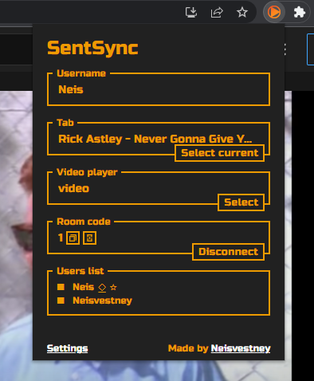

# SentSync
  
Chrome extension for syncing video progress with your friends  
[Demo video](https://youtu.be/nfwCOqp5eEk)  
Available in English / Доступно на русском языке

# Installing
- Go to releases and download the latest build
- Unpack extension somewhere
- [Enable in your browser developer mode and load it](https://developer.chrome.com/docs/extensions/mv3/getstarted/#unpacked)
# Using
[Demo video](https://youtu.be/nfwCOqp5eEk)
- Connect to server using same `Room code`
- Host press `Select current` to select tab and other clients automatically open the same tab
- Start playing video
  - _Synchronization occurs during pause or seek_
- If video progress not syncing by now try to select video player manually by `Select` button in `Video player` section
# Development
_The code for this extension is terrible because it's my first time developing such applications._ 
- `npm i`
- `npm start` for staring webpack with watcher 
- `npm build` for build
